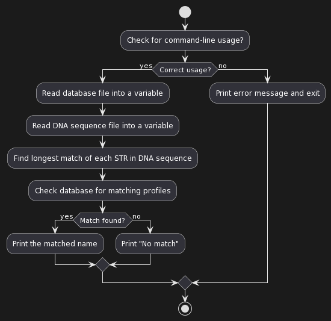

# DNA (Python)
This is a Python-based program designed to identify individuals based on their DNA sequences. It reads a DNA sequence and a database of STR (Short Tandem Repeats) counts for a list of individuals, then identifies the individual most likely associated with the DNA. This project exemplifies proficiency in Python, algorithmic thinking, and working with extensive data sets.

## Application Screenshot

## Tools Used
- Language: Python
- Skills Demonstrated: Data Processing, Algorithmic Thinking, Working with Large Datasets

### Connect with me:
- [LinkedIn](https://www.linkedin.com/in/joshuaowm/)
- [Email](mailto:joshuaowm@gmail.com)
- [Instagram](https://www.instagram.com/joshuaowm/)

Thank you for stopping by and exploring my code!