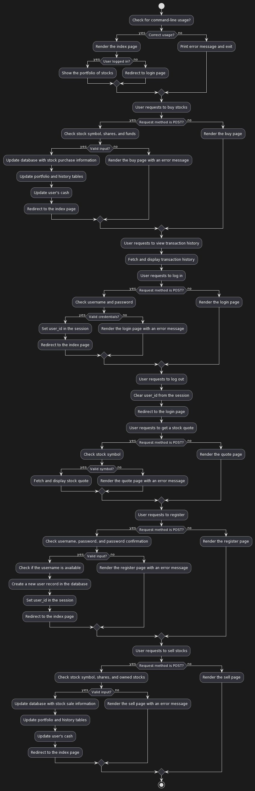

# Finance (Full-stack web app)
This is a web application that allows users to simulate stock trading by "buying" and "selling" stocks. Developed with Python using the Flask framework, it employs SQLite for database management, and HTML/CSS for front-end design. Users can register accounts, check real-time stock prices, manage their stock portfolio, and view transaction history.

## Application Screenshot

## Tools Used
- Languages: Python, HTML, CSS
- Framework: Flask
- Database: SQLite
- Skills Demonstrated: Web Development, Database Management, Front-End Design

### Connect with me:
- [LinkedIn](https://www.linkedin.com/in/joshuaowm/)
- [Email](mailto:joshuaowm@gmail.com)
- [Instagram](https://www.instagram.com/joshuaowm/)

Thank you for stopping by and exploring my code!